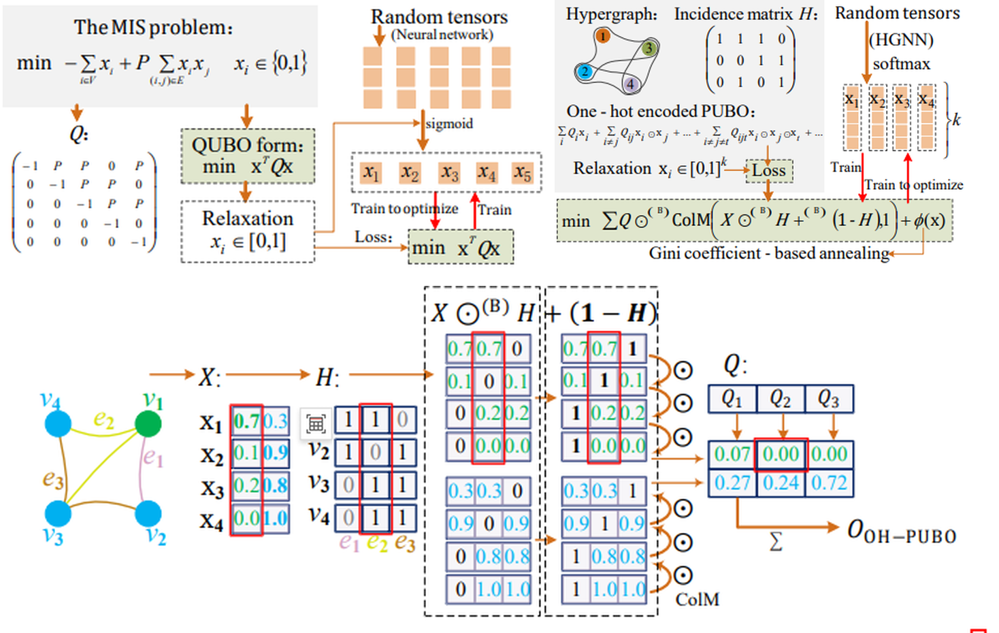
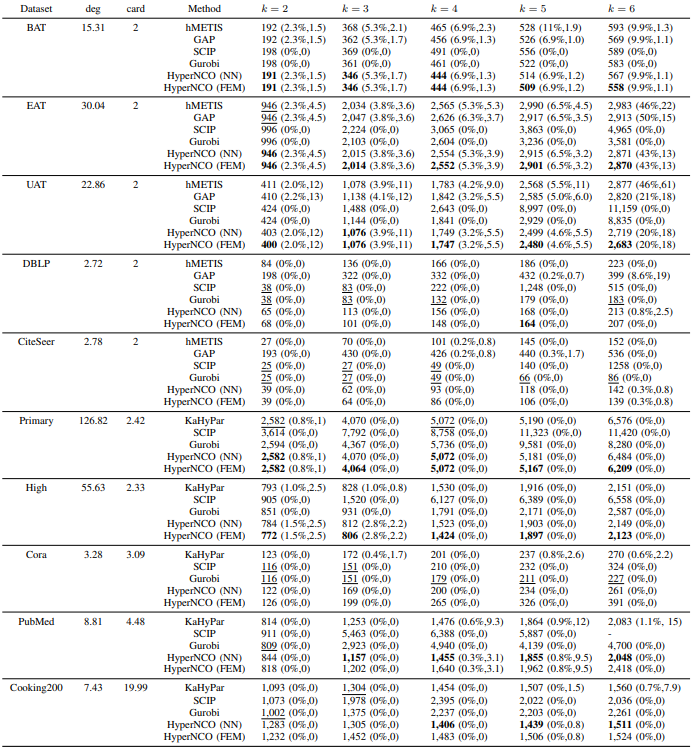
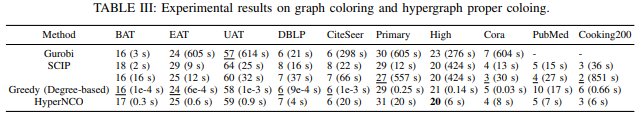
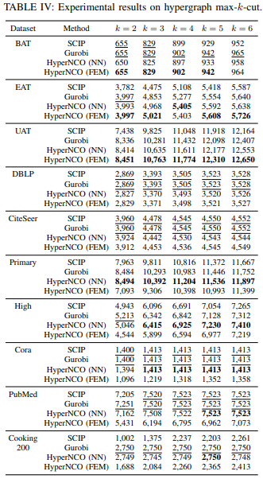

# HyperNCO
This repository is the official implementation of *HyperNCO: Neural Combinatorial Optimization on Hypergraphs*


## Requirements

To install requirements, you need [anaconda](https://www.anaconda.com/) or [miniconda](https://www.anaconda.com/docs/getting-started/miniconda/main) and run:

> conda env create -f environment.yaml  

## Run code

We provide a beautiful notebook file `examples/code` that combines code to restate our work in the paper and reproduces some experimental results for your reference, You can either just browse it using jupyter or try to re-run it even if it already contains all the results. 

In addition, we have provided some experiments in the `test/` folder

## Project directory structure

```
📦src
 ┣ 📂coloting
 ┃ ┣ 📜__init__.py
 ┃ ┣ 📜loss.py
 ┃ ┣ 📜models.py
 ┃ ┗ 📜utils.py
 ┣ 📂maxcut
 ┃ ┣ 📜__init__.py
 ┃ ┣ 📜loss.py
 ┃ ┣ 📜models.py
 ┃ ┗ 📜utils.py
 ┣ 📂partitioning
 ┃ ┣ 📜__init__.py
 ┃ ┣ 📜loss.py
 ┃ ┣ 📜models.py
 ┃ ┗ 📜utils.py
 ┣ 📂hgp
 ┃ ┣ 📜__init__.py
 ┃ ┣ 📜loss.py
 ┃ ┣ 📜models.py
 ┃ ┣ 📜function.py
 ┃ ┗ 📜utils.py
 ┣ 📜__init__.py
 ┣ 📜core.py
 ┗ 📜utils.py
 ```

## Results


### Hypergraph Partitioning Results



### Graph Coloring & Hypergraph Proper Coloring Results



### Hypergraph Max‑k‑cut Results



